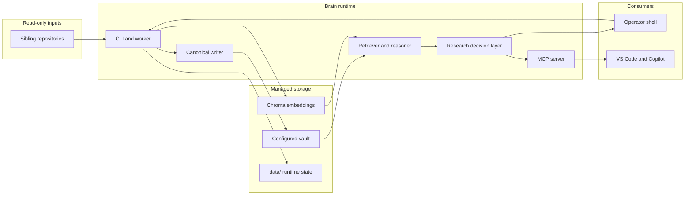
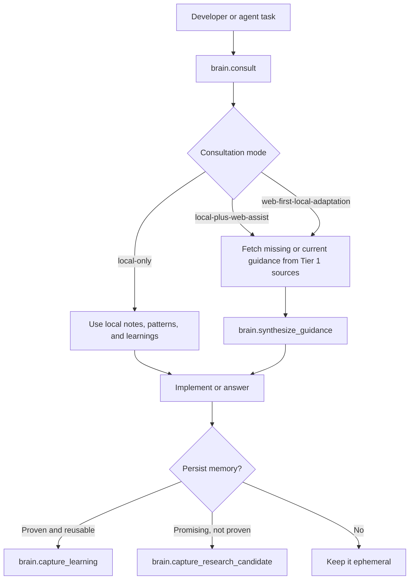

<div align="center">

# Brain

### The Local-First Developer Memory Runtime

*Canonical project memory, local retrieval, controlled research, and reusable documentation intelligence for repositories, Obsidian, and MCP-enabled agents.*

[](docs/ARCHITECTURE.md)
[](docs/DESIGN_RULES.md)
[](docs/MCP_INTEGRATION.md)
[](docs/EXAMPLE_RETRIEVAL.md)

<sub>Node.js | Python embeddings | canonical note model | MCP integration | local-first consultation</sub>

<p>
  <a href="#showcase">Showcase</a> |
  <a href="#what-brain-protects">What Brain Protects</a> |
  <a href="#how-it-moves">How It Moves</a> |
  <a href="#documentation-as-memory">Documentation as Memory</a> |
  <a href="#getting-started">Getting Started</a> |
  <a href="#documentation-map">Documentation Map</a>
</p>

</div>

> Brain is not a hosted AI note product. It runs on your machine, reads sibling repositories as read-only source input, keeps runtime state under `data/`, and writes a narrow managed knowledge model into an Obsidian vault that operators and agents can actually trust.

## Showcase

<table>
<tr>
<td width="33%" valign="top" align="center">

**Canonical Memory**

Generate exactly the project notes Brain can defend: `overview`, `architecture`, `learnings`, and `prompts`.

</td>
<td width="33%" valign="top" align="center">

**Research Discipline**

Choose explicitly between `local-only`, `local-plus-web-assist`, and `web-first-local-adaptation` instead of letting agents improvise.

</td>
<td width="33%" valign="top" align="center">

**Documentation Intelligence**

Learn reusable README, architecture-doc, troubleshooting, and agent-instruction patterns from strong repositories and reuse them locally.

</td>
</tr>
</table>

## What Brain Protects

| Failure mode | Brain response |
| --- | --- |
| Repo context decays into stale notes | Rewrite a narrow canonical note set instead of accumulating ad hoc summaries |
| Agents answer with generic web advice | Start from local retrieval, related patterns, and recent learnings before escalating |
| Agents cannot explain why a learning is trustworthy | Preserve evidence traces, confidence, and support counts from analysis through retrieval and consultation |
| External research pollutes long-term memory | Keep provisional findings in `research-candidates.md` until they are proven |
| Vault structure drifts over time | Fail fast with `brain:validate:vault` and `brain:doctor` |
| Documentation work starts from generic markdown | Reuse documentation-style patterns derived from strong local repositories |

## How It Moves



The runtime stays intentionally small. `apps/cli` is the operator surface, `packages/obsidian-writer/canonical-writer.mjs` is the only active note writer, `packages/vault-contract` defines the canonical note model, and `apps/mcp-server` exposes the `brain.*` tool surface agents use.

## Documentation As Memory

Brain now treats documentation as four things at once:

- the repository presentation layer people judge from the front page
- the onboarding surface new maintainers rely on first
- the instruction surface agents read before they touch code
- the architecture communication layer that keeps real system boundaries legible

That change is reflected in the managed knowledge model. Cross-project memory now has two first-class reusable knowledge notes:

- `04_Knowledge_Base/reusable-patterns.md`
- `04_Knowledge_Base/documentation-style-patterns.md`

During analysis, Brain can derive documentation-style patterns from real repo evidence such as:

- README hero structure, pacing, and anchor navigation
- showcase panels and scan-friendly section rhythm
- Mermaid usage that clarifies the system instead of decorating it
- focused subdocs for architecture, operator workflow, troubleshooting, and integration
- agent-instruction surfaces such as `AGENTS.md` and `.github/copilot-instructions.md`

That is what lets future README and docs work start from strong local precedent instead of generic markdown templates.

## Inspectable Trust

Brain now treats durable memory as something it must justify, not just retrieve.

- Analysis extracts provenance-backed boundary rules, validation surfaces, reusable solutions, and documentation patterns from real repo evidence.
- Normalization and chunking preserve `provenance-v1`, confidence, evidence quality, support count, and supporting source traces instead of flattening everything into plain strings.
- `brain:query` now explains both why a result matched and why it is trustworthy.
- `brain:consult` now returns a trust summary, local evidence basis, and clearer reasons when external guidance is still required.
- The canonical writer surfaces provenance selectively through confidence and evidence lines in learnings and documentation-style patterns without dumping raw metadata into the vault.

## Consultation Flow



This is the central discipline of the repo: local context first, web research only when justified, and selective write-back instead of automatic memory growth.

## Getting Started

```bash
npm run brain:bootstrap:python
npm run brain:init
npm run brain:sync
npm run brain:validate:vault
npm run brain:doctor
npm run brain:embed
npm run brain:consult -- "best practice for token refresh handling"
npm run brain:query -- "auth bug solution"
npm run brain:mcp
```

What each stage does:

- `brain:bootstrap:python` creates `.venv` and installs the local embedding stack.
- `brain:init` creates runtime folders, vault scaffolding, and launcher scripts under `data/runtime/`.
- `brain:sync` refreshes canonical project notes and managed global notes, including cross-project documentation-style patterns.
- `brain:validate:vault` fails if legacy markers, project logs, knowledge mirrors, or runtime artifacts reappear in the vault.
- `brain:doctor` checks vault integrity, retrieval readiness, consultation behavior, and MCP health.
- `brain:doctor`, `brain:query`, and `brain:consult` now also verify that the runtime can expose trust-aware evidence fields instead of returning opaque matches.
- `brain:embed` rebuilds the local semantic index.
- `brain:consult` is the primary guidance entrypoint.
- `brain:query` is the lower-level retrieval debugger.
- `brain:mcp` starts the `local-brain` MCP server.

## Repo Layout

| Path | Role |
| --- | --- |
| `apps/` | Operator-facing entrypoints for CLI, MCP, worker, and optional API surfaces |
| `packages/` | Reusable runtime modules for scanning, normalization, embeddings, retrieval, research, vault writing, and state |
| `docs/` | GitHub-facing design, setup, integration, and operator documentation |
| `data/` | Local runtime state, logs, cache, generated launchers, and Chroma storage |
| `obsidian-sync/` | Sandbox validation vault for self-test and local verification |
| `prompts/` | Internal prompt assets used by the runtime |
| `tests/` | Runtime smoke tests and contract validation coverage |

The storage split is deliberate: source lives in the repository, runtime state lives under `data/`, and human-readable knowledge lives in the configured vault.

## Documentation Map

- [Documentation Map](docs/README.md)
- [First Run](docs/FIRST_RUN.md)
- [Operator Guide](docs/OPERATOR_GUIDE.md)
- [Architecture](docs/ARCHITECTURE.md)
- [MCP Integration](docs/MCP_INTEGRATION.md)
- [Design Rules](docs/DESIGN_RULES.md)
- [Example Retrieval](docs/EXAMPLE_RETRIEVAL.md)
- [.github/copilot-instructions.md](.github/copilot-instructions.md)
- [AGENTS.md](AGENTS.md)

## Extend Carefully

Extend Brain only when the new surface improves daily development leverage. The stable contract is the canonical writer path, the vault contract, the `brain.*` MCP tool surface, and the operator workflow built around `init`, `sync`, `validate:vault`, `doctor`, `embed`, `consult`, `query`, `status`, and `mcp`.

If you change any of those surfaces, validate the result with the matching checks:

```bash
npm run brain:init
npm run brain:validate:vault
npm run brain:doctor
npm run brain:test
npm run brain:mcp:healthcheck
```