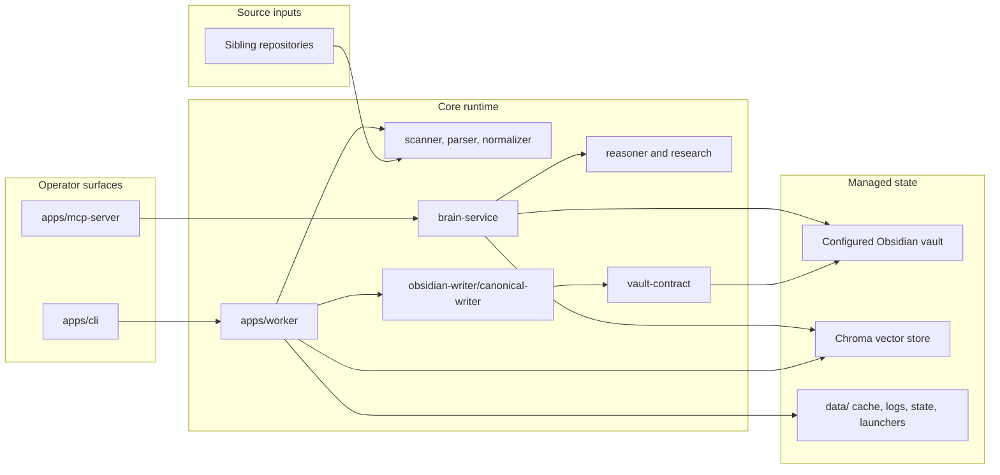
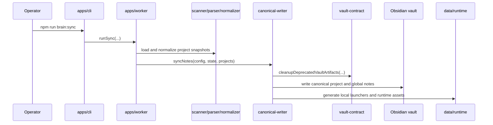
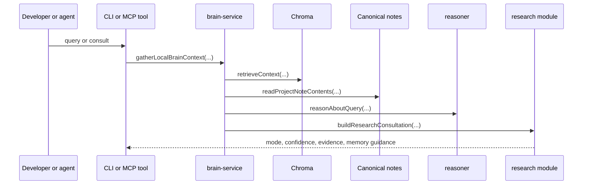

# Architecture

Brain is a local-first developer memory runtime. It reads sibling repositories as source input, writes canonical knowledge notes into an Obsidian vault, embeds that note model locally, and serves the same memory to operators and agents through CLI and MCP surfaces.

## Architectural Intent

| Concern | Design response |
| --- | --- |
| Durable repo memory | Generate a narrow, canonical note model instead of free-form repository dumps |
| Retrieval quality | Combine local embeddings, note-aware retrieval, and lightweight reasoning |
| Agent usability | Expose a stable `brain.*` tool contract through MCP |
| Research control | Decide explicitly between `local-only`, `local-plus-web-assist`, and `web-first-local-adaptation` |
| Documentation quality | Learn reusable repo-facing documentation patterns from real repository surfaces |
| Drift prevention | Enforce the vault contract and fail fast on deprecated note surfaces |

Everything else in the repository exists to support those five outcomes.

## System Boundaries

| Area | Writable | Role | Must not become |
| --- | --- | --- | --- |
| Sibling repositories under the configured projects root | No | Read-only source input for project analysis | A write target or automation playground |
| Configured Obsidian vault | Yes | Human-readable knowledge output | Runtime state, logs, caches, or launchers |
| `data/` | Yes | Local runtime state, cache, logs, generated launchers, and Chroma storage | Canonical documentation or durable project notes |
| `obsidian-sync/` | Yes | Sandbox validation vault for self-test and local verification | The assumed live vault in production use |
| Brain source tree | Yes | Runtime and documentation code | A mirror of the vault or the vector store |

## Runtime Topology

## Authoritative Files

| Path | Authority |
| --- | --- |
| `apps/cli/index.mjs` | Canonical operator command surface for `init`, `scan`, `sync`, `embed`, `query`, `consult`, `validate-vault`, `doctor`, `learn`, `watch`, and `status` |
| `apps/worker/index.mjs` | Main orchestration layer behind CLI operations |
| `apps/mcp-server/index.mjs` | Sole MCP entrypoint and stable registration surface for `local-brain` |
| `packages/brain-service/index.mjs` | Search, consultation, synthesis, project summary, related patterns, recent learnings, and write-back tools |
| `packages/research/index.mjs` | Consultation mode selection, source prioritization, and memory-level guidance |
| `packages/obsidian-writer/canonical-writer.mjs` | Only active note writer and vault bootstrap path |
| `packages/vault-contract/index.mjs` | Canonical note paths, cleanup rules, and validation logic |
| `packages/vector-store/index.mjs` | Local Chroma integration |
| `packages/state-manager/index.mjs` | Runtime state and query-history persistence |

## Canonical Vault Contract

### Project notes

Each project folder under `01_Projects/<ProjectName>/` is allowed exactly four managed notes:

| File | Purpose |
| --- | --- |
| `overview.md` | Project purpose, stack, boundaries, and change guidance |
| `architecture.md` | Runtime structure, interfaces, and extension points |
| `learnings.md` | Durable, implementation-backed lessons |
| `prompts.md` | Retrieval and agent prompt scaffolding for safe work |

### Global notes

| Path | Purpose |
| --- | --- |
| `01_Projects/_Project_Index.md` | Project index across the vault |
| `03_Agent_Notes/query-history.md` | Query and consultation history written from runtime state |
| `03_Agent_Notes/debugging-insights.md` | Durable debugging guidance |
| `03_Agent_Notes/agent-workflow-notes.md` | Operator and agent workflow notes |
| `03_Agent_Notes/research-candidates.md` | Optional holding area for promising but unproven external findings |
| `04_Knowledge_Base/reusable-patterns.md` | Cross-project reusable engineering patterns |
| `04_Knowledge_Base/documentation-style-patterns.md` | Cross-project reusable repository presentation and documentation patterns |
| `06_Summaries/Portfolio_Summary.md` | High-level summary surface |
| `99_System/AI_Brain_Architecture.md` | System architecture note written into the vault |
| `99_System/Operations.md` | Operational guidance note written into the vault |
| `99_System/Retrieval.md` | Retrieval guidance note written into the vault |

### Deprecated surfaces the runtime actively rejects

- per-project `logs.md`
- per-project knowledge mirrors such as `04_Knowledge_Base/<ProjectName>.md`
- legacy generated markers such as `<!-- AI_BRAIN:GENERATED_START -->`
- runtime artifacts inside the vault, including launchers, state files, Chroma files, or runtime directories

`research-candidates.md` is intentionally optional and intentionally excluded from the semantic core. It exists to keep web-assisted work controlled without promoting raw external summaries into durable memory.

## Documentation As First-Class Knowledge

Brain does not treat documentation as a cosmetic layer outside the memory system. It analyzes repo-facing surfaces such as `README.md`, architecture and operator docs, troubleshooting docs, and agent-instruction files so future documentation work can start from local precedent.

At normalization time, documentation signals and documentation patterns become part of the project snapshot. At write time, the canonical writer can synthesize those patterns into `documentation-style-patterns.md`. At retrieval time, documentation-shaped queries can surface those patterns alongside implementation learnings.

## Write Path: Sync and Canonicalization

The sync path is not just a note writer. It also bootstraps vault folders, ensures canonical note surfaces exist, removes deprecated vault artifacts, writes managed global notes, refreshes reusable documentation-style patterns, and generates local launchers such as `run-brain.sh`, `run-brain-mcp.sh`, and `com.local.ai-brain.plist` under `data/runtime/`.

## Canonical Writer Path

`packages/obsidian-writer/canonical-writer.mjs` is the only active writer implementation.

Its active responsibilities are:

- `bootstrapVault(config)` to create canonical folders, static note scaffolding, and local launchers
- `syncNotes(config, state, projects)` to clean deprecated vault artifacts and rewrite canonical note surfaces
- `writeManagedKnowledgeNotes(config, state, projects)` to keep global notes aligned with runtime state
- `readProjectNoteContents(config, project)` to feed retrieval with canonical notes while stripping legacy marker-era content when encountered

There is no supported dual-writer or legacy renderer path. Compatibility shims may exist around old entrypoints, but they are not part of the canonical architecture.

## Retrieval and Consultation Flow

`brain.query` and `brain.consult` share the same local retrieval foundation. The difference is that `brain.consult` adds research mode selection, source prioritization, and memory guidance so agents know whether they should stay local or pull in external validation. Documentation-shaped queries can also reuse cross-project documentation patterns when Brain detects that the task is about repo presentation, architecture docs, operator docs, or agent guidance.

## Local-First and Web-Assisted Model

| Mode | When it is appropriate | Expected behavior |
| --- | --- | --- |
| `local-only` | Local context is strong and the question is repo-shaped | Stay inside local notes, patterns, and learnings |
| `local-plus-web-assist` | Local context is useful but incomplete for current guidance | Start from local memory, then fetch only the missing official guidance |
| `web-first-local-adaptation` | The question is current, migration-heavy, version-sensitive, or security-sensitive | Lead with authoritative sources, then adapt the result back into the repo context |

Tier 1 sources are the default web targets: official docs, API references, migration guides, standards, and maintainer-authored security guidance.

## MCP and Agent Contract

The MCP server exposes eight stable tools:

- `brain.search`
- `brain.consult`
- `brain.synthesize_guidance`
- `brain.project_summary`
- `brain.related_patterns`
- `brain.recent_learnings`
- `brain.capture_learning`
- `brain.capture_research_candidate`

The intended agent sequence is:

1. `brain.consult`
2. Optional web research from authoritative sources when the returned mode requires it
3. `brain.synthesize_guidance`
4. Implementation or recommendation
5. Selective write-back through either `brain.capture_learning` or `brain.capture_research_candidate`

`brain.search` remains important, but it is the retrieval debugger rather than the preferred first step for non-trivial work.

## Validation and Anti-Drift Protections

| Guardrail | What it checks |
| --- | --- |
| `brain:validate:vault` | Unexpected project note files, legacy markers, per-project knowledge mirrors, per-project logs, and runtime artifacts in the vault |
| `brain:doctor` | Vault validity, knowledge model version mismatches, deprecated retrieval surfaces in chunk cache, missing embeddings, query smoke results, consult smoke behavior, and MCP tool availability |
| `brain:mcp:healthcheck` | Whether the MCP server starts cleanly and exposes the expected `brain.*` tool surface |

The anti-drift model is explicit: remove deprecated artifacts before they survive into retrieval, then run smoke tests that prove the runtime still behaves the way the docs describe.

## Configuration Precedence and Storage Defaults

Configuration resolution is consistent across CLI and MCP:

1. CLI flags
2. Environment variables
3. `brain.config.json`
4. Safe defaults

Default locations are intentionally local and portable:

- projects root: parent directory of the Brain repository
- vault root: `~/Obsidian/Brain` when present, otherwise `./obsidian-sync`
- data root: `./data`

## Secondary Surfaces

`watch`, the optional local API, and sandbox self-test are real features, but they are secondary to the core operator path. The system should still make sense if a user only ever touches `init`, `sync`, `validate:vault`, `doctor`, `embed`, `consult`, `query`, `status`, and `mcp`.