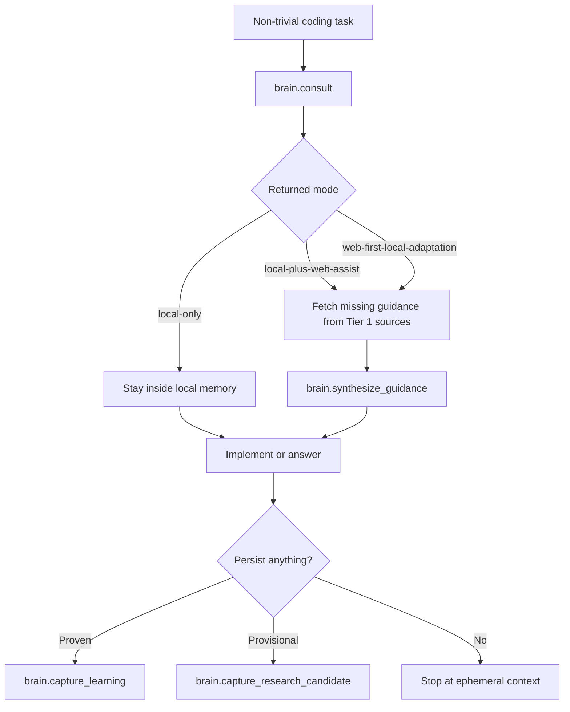

# MCP Integration

This document describes the runtime contract between Brain, VS Code, and MCP-enabled agents.

## Entry Points

Brain exposes a single MCP server named `local-brain`.

You can start it through either of these targets:

- `npm run brain:mcp`
- `data/runtime/run-brain-mcp.sh` after `brain:init` has generated the local launcher

The canonical source entrypoint is `apps/mcp-server/index.mjs`. The generated shell launcher exists for tooling that prefers a stable executable path.

## Stable Tool Contract

| Tool | Use it for |
| --- | --- |
| `brain.search` | Semantic search and retrieval debugging before non-trivial edits |
| `brain.consult` | Local-first engineering consultation with research-mode selection |
| `brain.synthesize_guidance` | Combining authoritative external findings with local repo context |
| `brain.project_summary` | Fast project briefing for the current repo, including documentation-pattern context |
| `brain.related_patterns` | Cross-project reusable implementation and documentation patterns |
| `brain.recent_learnings` | Recent debugging and implementation learnings |
| `brain.capture_learning` | Durable, validated learning capture |
| `brain.capture_research_candidate` | Provisional external finding capture without polluting the semantic core |

`brain.consult` is the primary entrypoint for real work. `brain.search` is the lower-level retrieval debugger.

## Documentation-Aware Context

For repo-facing documentation tasks, the MCP surface can now expose more than plain project summaries. `brain.project_summary` may include `documentationPatterns`, `boundaries`, and `validationSurfaces`, and consult-style local context can include `noteReferences.documentationStyle` so agents can trace documentation guidance back to the managed knowledge note.

That means README, architecture-doc, operator-doc, and agent-instruction work can start from local benchmark patterns instead of generic markdown generation, while implementation work can start from real project boundaries and the nearest validation surface rather than broad stack summaries.

## Provenance-Aware Responses

The MCP payloads are now explicitly trust-aware.

- `brain.search` results include `whyTrusted`, `sourceKind`, `knowledgeType`, `knowledgeStrength`, `evidenceQuality`, `confidence`, `supportCount`, `supportingSources`, `derivedFrom`, and `evidenceSummary`.
- `brain.consult` includes `trustSummary`, `localContext.evidenceBasis`, and evidence-rich `topResults`, `relatedPatterns`, and `recentLearnings`.
- `brain.project_summary` includes provenance-backed `boundaries`, `validationSurfaces`, and a top-level `provenance` object with the strongest evidence records.
- `brain.related_patterns` and `brain.recent_learnings` now expose trust fields so agents can prefer stronger reusable memory instead of assuming every pattern is equally reliable.

These fields are additive and compatible with existing clients. Agents that do not need them can ignore them, but agents doing non-trivial work should use them to decide whether local memory is strong enough to lead.

## Recommended Registration Targets

The exact shape of your user MCP config depends on your editor schema, but the launched process should resolve to one of these two command targets:

```text
/absolute/path/to/brain/data/runtime/run-brain-mcp.sh
```

or

```text
node /absolute/path/to/brain/apps/mcp-server/index.mjs
```

Use the generated runner when you want a stable shell entrypoint that survives Node path changes. Use the Node entrypoint when you prefer explicit control over the command and args.

## Agent Flow



This is the intended integration model: local context first, targeted official research second, selective write-back last.

## Configuration Resolution

The MCP server uses the same precedence order as the CLI:

1. CLI flags
2. Environment variables
3. `brain.config.json`
4. Safe defaults

That keeps the MCP surface aligned with the operator surface and avoids hardcoded machine-specific paths in source.

## Startup, Health, and Logs

Start the server directly:

```bash
npm run brain:mcp
```

Run a healthcheck without holding an MCP session open:

```bash
npm run brain:mcp:healthcheck
```

Inspect runtime logs here:

- `data/logs/brain-mcp.log`

Healthy integration means:

- `brain:mcp:healthcheck` starts cleanly
- the reported tool list includes every expected `brain.*` tool
- VS Code shows `local-brain` in `MCP: List Servers`
- the server is trusted by the editor

## What Copilot Should Do

When user-level instructions and MCP registration are in place, Copilot should follow this behavior:

1. Call `brain.consult` first for non-trivial work.
2. Stay local when the mode is `local-only`.
3. Use authoritative sources first when the mode requires research.
4. Call `brain.synthesize_guidance` before adapting external guidance to the current repo.
5. Capture only proven learnings or explicit research candidates.
6. For README, docs, and agent-guidance tasks, prefer local documentation patterns and benchmark repo surfaces before inventing a new structure.
7. Prefer results with stronger evidence quality and clearer supporting traces when multiple local answers are available.

The write-back discipline is strict:

- local memory first
- research only when justified
- candidate findings separate from proven reusable memory
- no automatic promotion of raw external findings into permanent notes

## Troubleshooting

| Problem | Recovery |
| --- | --- |
| Server does not start | Run `npm run brain:init`, then `npm run brain:mcp:healthcheck`, then inspect `data/logs/brain-mcp.log` |
| Tool list is incomplete | Confirm the current source is `apps/mcp-server/index.mjs`, rerun healthcheck, and verify no stale launcher path is registered |
| VS Code does not show `local-brain` | Fix the user MCP config, then reopen `MCP: List Servers` and trust the server |
| Copilot does not use the tools | Check user MCP config, trust state, and the user-level instructions that tell Copilot to consult the brain |
| Results are weak even though MCP is healthy | Run `brain:sync`, `brain:doctor`, and `brain:embed` to refresh the local memory core |

## Validation After Integration Changes

If you change MCP wiring, tool behavior, or runtime launcher generation, run:

```bash
npm run brain:init
npm run brain:test
npm run brain:doctor
npm run brain:mcp:healthcheck
```